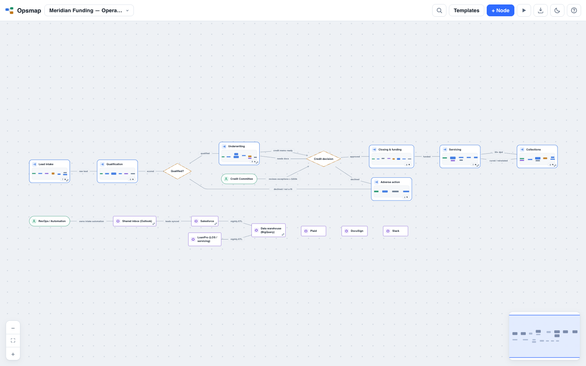

# Serigraph

**The operating model as a file.** Map how a business actually runs — every function, stage, handoff, cost assumption, and automation opportunity — in one plain YAML file, then use that same graph as an automation plan, product brief, and delivery roadmap. Serigraph renders nested, typed nodes on an elegantly zoomable canvas. Humans can edit the canvas or the text without losing comments; software agents read and write the same source; and the economics of automating a step live beside the step itself. A discovery-call transcript can become the first reviewable draft, with every inference kept visible until a human confirms it.



## Run it

```sh
npm start
```

That is it: no `npm install`, build step, account, or cloud service. Serigraph requires [Node.js](https://nodejs.org) 18+; its two runtime libraries are vendored into the repository.

Use the map switcher, or open these seeded examples directly:

- [Summit Insurance](http://localhost:4700/#/map/insurance), an independent agency mapped from prospect through bind, billing, claims, and renewal.
- [Brightside Dental](http://localhost:4700/#/map/brightside-demo), a process derived from a discovery-call transcript, with nested sub-maps, live economics, and two still-unconfirmed inferences.
- [Meridian Funding](http://localhost:4700/#/map/lending), a four-level lending process from lead intake through servicing.

> Port busy or don't want a browser popping open? `PORT=5000 npm start`, or `node server/main.js --no-open`.
>
> The server listens on **localhost only** (client data stays on your machine — see [docs/DATA-HANDLING.md](docs/DATA-HANDLING.md)). To share on your network deliberately: `node server/main.js --lan`.

## Process maps and Freeform maps

Choose a mode when you create a map:

- **Process** maps work from step to step. They include decisions, owner lanes, path tracing, automation, cost, Brief, Roadmap, and Audit.
- **Freeform** maps systems, databases, APIs, people, documents, and other items. One shared element can appear in several groups without copying its facts.

Files without a `mode` field use Process mode. A populated map cannot switch modes because Process and Freeform files store their contents differently. Use the **Systems of Record** template to start a Freeform map.

## One source, four useful views

The file is the truth. A graph lives in `maps/<name>.yaml`; visual edits write back to that file, file edits live-reload into the canvas, and YAML comments survive supported edits.

The view switcher turns that one graph into four working surfaces:

| View | What it is for |
|---|---|
| **Map** | Design the process or product story as a nested, navigable graph. |
| **Brief** | Read a graph-backed PRD with goals, problems, objectives, requirements, acceptance criteria, evidence, decisions, risks, and metrics. |
| **Roadmap** | See eligible planning nodes in Now, Next, Later, named-target, and Unscheduled lanes; filter by status, priority, owner, or text. |
| **Audit** | Run deterministic readiness checks for ownership, proof, traceability, priority, scheduling, dependencies, risk coverage, and cycles. |

Open the checked-in examples after starting the app:

- [Serigraph Product Documents PRD](http://localhost:4700/#/map/serigraph-prd)
- [Serigraph Product Roadmap](http://localhost:4700/#/map/serigraph-roadmap)

The detailed product contract is in [docs/PRODUCT-REQUIREMENTS.md](docs/PRODUCT-REQUIREMENTS.md), with the completed release evidence in [docs/RELEASE-VERIFICATION.md](docs/RELEASE-VERIFICATION.md). The PRD and roadmap above are not screenshots or duplicate planning stores: they are real Serigraph charts that dogfood the public YAML format.

## Product documents

Any existing map can become a product document by adding an optional top-level `document:` block and optional `planning:` and `relations:` fields to its nodes. The original five visual node types remain unchanged; product semantics are a separate layer.

```yaml
name: Customer onboarding automation
document:
  kind: prd
  version: "1.1"
  status: planned
  owner: Product & Operations
  summary: Reduce onboarding delay without hiding compliance risk.
  goals:
    - Cut median onboarding time from five days to one.
  successMetrics:
    - 80% of eligible cases complete without manual re-entry.

nodes:
  - id: onboarding-objective
    type: process
    label: One-day onboarding
    owner: Product
    planning:
      type: objective
      status: planned
      priority: must

  - id: automate-handoff
    type: process
    label: Automate the verified handoff
    owner: Automation team
    planning:
      type: requirement
      status: planned
      priority: must
      phase: now
      target: 2026-Q4
      acceptance:
        - A verified case reaches the system of record exactly once.
      evidence:
        - Baseline map shows duplicate entry in two teams.
      rice:
        reach: 500
        impact: 2
        confidence: 80
        effort: 4
    relations:
      - to: onboarding-objective
        type: supports
```

RICE is transparent: `(reach × impact × confidence/100) ÷ effort`. All four inputs are required for a score; Roadmap ranking uses the full-precision value even when the display is rounded. Select **Score** on a roadmap card to edit the inputs.

From Brief, use **Edit document** to maintain document metadata and **Download Markdown** to publish a clean, portable PRD. **Share & export** can also produce a standalone read-only HTML application.

The complete schema, enums, validation rules, and examples are in [docs/FORMAT.md](docs/FORMAT.md). A reusable starting slice is available at [templates/product-requirement-slice.yaml](templates/product-requirement-slice.yaml).

## Using the map

| Do this | Get this |
|---|---|
| **Double-click** a node with a badge (or press ⏎) | Zoom into its sub-map — any depth, breadcrumbs keep you oriented |
| **Pan toward a connected group** | Keep exploring on the same canvas. Click its frame or any item inside it to make that group active. The minimap spans the full connected view |
| **Esc** / ⌫ | Zoom back out one level |
| **⌘K** | Search every node at every level, jump straight to it |
| **Click** a Process node | Inspect the step, product facts, links, related nodes, and its sub-map |
| **Click** a Freeform card | Inspect its shared definition and local group note. Every placement of that element is highlighted |
| **`#id ⧉`** in the inspector | Copy a deep link and open that exact node |
| **✨ Import** | Paste a meeting or discovery transcript and get a reviewable Process map. Inferred items stay marked until reviewed. This needs `ANTHROPIC_API_KEY`, a logged-in `claude` CLI, or `OPSMAP_LLM_CMD` |
| **$ Economics** | Add monthly volume, human time and rate, and agent cost to Process steps. Unknown values stay out of totals |
| **Add step** | Add a new Process node |
| **Add item** | In a Freeform group, choose an existing shared element or create and place a new one |
| **Add group** | Add a top-level Freeform group |
| **Drag from the palette** | Drop a new typed item at that position |
| **Drag a card** | Pin it at that position. In Freeform, dragging into another group moves only that placement |
| **Drag from a card's port** | Draw an edge to another card in the same scope |
| **Remove from group** | Remove one Freeform placement while keeping the shared element and its other placements |
| **Delete shared element** | Remove the definition, all placements, and all connections after confirmation |
| **Templates** | Insert a reusable block that matches the current map mode |
| **Shift+P** | Enter presentation mode and walk through a Process flow |
| **Share & export** | Copy a deep link or download a read-only HTML application that works offline |
| **?** | Open the shortcut reference |

## For software agents

- Read and write `maps/*.yaml` directly. The running app detects file changes.
- Use [docs/FORMAT.md](docs/FORMAT.md) as the complete public contract.
- Validate without opening the interface: `node tools/validate.mjs maps/your-map.yaml`.
- Deep-link a node: `http://localhost:4700/#/map/<file>/node/<node-id>`.
- In Freeform, define each identity once in `elements` and place it with `use` inside groups.
- Keep definition IDs stable. Process edges connect sibling nodes. Freeform group edges connect placements. Typed relations record cross-scope Process meaning or shared-element hierarchy.
- Do not infer missing evidence. Audit checks structure, not whether a claim is true.

## Project layout

```text
maps/         process maps and product documents (YAML, the source of truth)
templates/    reusable process and product blocks (the same graph format)
docs/         format contract, PRD, verification, and design records
app/          web application (vanilla ES modules, no build)
server/       zero-dependency Node server, API, live reload, and export
shared/       parser and validator used by app, server, and tools
tools/        validator and deterministic test-map generator
vendor/       vendored yaml and dagre libraries
tests/        Node test suite
```

The product and interface are named **Serigraph**. For backwards compatibility, the internal npm package, repository directory, import namespace, and browser storage keys retain the historical `opsmap` identifier. Treat `opsmap` as an implementation identifier, not the customer-facing brand.

## Handy commands

```sh
npm start          # serve Serigraph at http://localhost:4700
npm test           # run parser, editing, product-planning, and export tests
npm run validate   # validate every checked-in map and template
node tools/generate-map.mjs --nodes 300 --depth 4 --seed 7 --out maps/stress.yaml
```

## Backwards compatibility

Product-document fields are entirely optional. A file without `document:` is normalized as `document.kind: process`; nodes without `planning:` or `relations:` behave exactly as before. Existing visual types, edges, nesting, deep links, edit history, presentation, and standalone export require no migration.

## Roadmap

The forward roadmap is itself a Serigraph artifact: open [maps/serigraph-roadmap.yaml](maps/serigraph-roadmap.yaml) in the app's Roadmap view to review the Now, Next, and Later portfolio. The longer-range product strategy lives in **[docs/ROADMAP.md](docs/ROADMAP.md)**: close the trust loop around transcript import, deepen the economics toward CFO-grade, make provenance evidence-grade, then build the governed change loop where agents propose, humans approve, and an audit trail records.

Design decisions and the July 2026 review verdict live in **[docs/DESIGN.md](docs/DESIGN.md)**; what leaves your machine, and how to run fully local, is documented in **[docs/DATA-HANDLING.md](docs/DATA-HANDLING.md)**.
